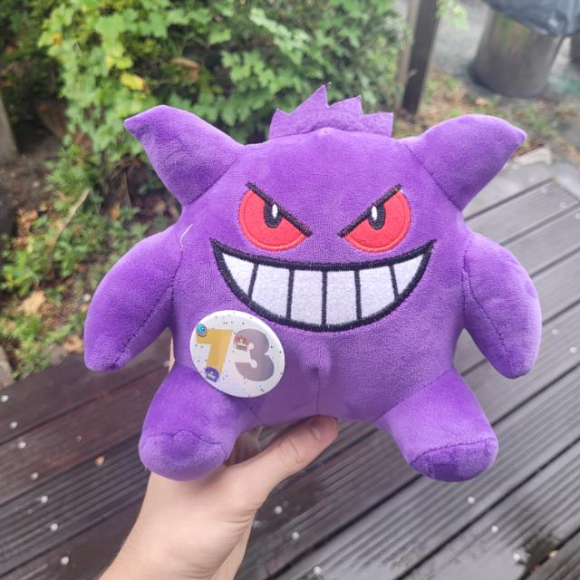
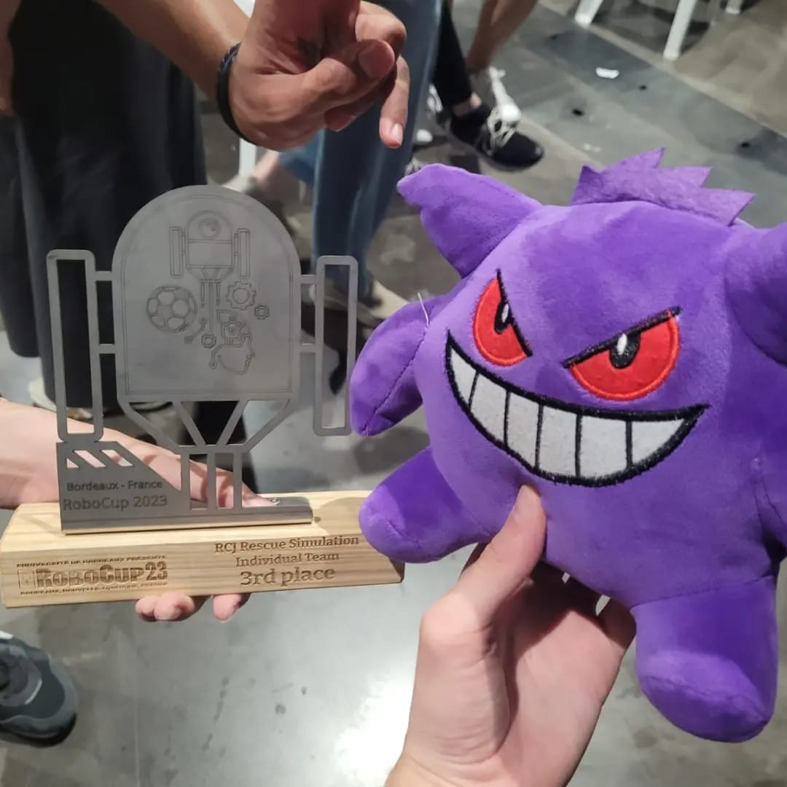

# 73-Robits

We are 73 RoBits, a team  from Brazil that participates in [RoboCup Junior](https://rescue.rcj.cloud/), [Rescue Simulation](https://junior.robocup.org/robocupjuniorrescue-league-simulation/).
In this repository, you will find our source code, maps for testing as well as documents submitted to the RCJ organization.

## Cloning the repository
To clone your repository:
1. Open Git Bash.
2. Change the current working directory to the location where you want the cloned directory.
3. Type `git clone https://github.com/coral-knight/73-Robits.git` 

## Other documents
You can also access the following documents:
- [Team Description Paper](documents/TDP_2024.pdf)
- [Engineering Journal](documents/engineeringjournal.pdf)
- [Poster](documents/poster.pdf)

## Gengar
Here is Gengar, our little pet that follows us through the entire journey
 
⠀⠀⠀⠀⠀⢸⠓⢄⡀⠀⠀⠀⠀⠀⠀⠀⠀⠀⠀⠀⠀⠀⠀⠀⠀⠀⠀⠀⠀⠀
⠀⠀⠀⠀⠀⢸⠀⠀⠑⢤⡀⠀⠀⠀⠀⠀⠀⠀⠀⠀⠀⠀⠀⠀⠀⠀⠀⠀⠀⠀
⠀⠀⠀⠀⠀⢸⡆⠀⠀⠀⠙⢤⡷⣤⣦⣀⠤⠖⠚⡿⠁⠀⠀⠀⠀⠀⠀⠀⠀⠀
⣠⡿⠢⢄⡀⠀⡇⠀⠀⠀⠀⠀⠉⠀⠀⠀⠀⠀⠸⠷⣶⠂⠀⠀⠀⣀⣀⠀⠀⠀
⢸⣃⠀⠀⠉⠳⣷⠞⠁⠀⠀⠀⠀⠀⠀⠀⠀⠀⠀⠈⠉⠉⠉⠉⠉⠉⠉⢉⡭⠋
⠀⠘⣆⠀⠀⠀⠁⠀⢀⡄⠀⠀⠀⠀⠀⠀⠀⠀⠀⠀⠀⠀⠀⠀⠀⢀⡴⠋⠀⠀
⠀⠀⠘⣦⠆⠀⠀⢀⡎⢹⡀⠀⠀⠀⠀⠀⠀⠀⠀⡀⠀⠀⡀⣠⠔⠋⠀⠀⠀⠀
⠀⠀⠀⡏⠀⠀⣆⠘⣄⠸⢧⠀⠀⠀⠀⢀⣠⠖⢻⠀⠀⠀⣿⢥⣄⣀⣀⣀⠀⠀
⠀⠀⢸⠁⠀⠀⡏⢣⣌⠙⠚⠀⠀⠠⣖⡛⠀⣠⠏⠀⠀⠀⠇⠀⠀⠀⠀⢙⣣⠄
⠀⠀⢸⡀⠀⠀⠳⡞⠈⢻⠶⠤⣄⣀⣈⣉⣉⣡⡔⠀⠀⢀⠀⠀⣀⡤⠖⠚⠀⠀
⠀⠀⡼⣇⠀⠀⠀⠙⠦⣞⡀⠀⢀⡏⠀⢸⣣⠞⠀⠀⠀⡼⠚⠋⠁⠀⠀⠀⠀⠀
⠀⢰⡇⠙⠀⠀⠀⠀⠀⠀⠉⠙⠚⠒⠚⠉⠀⠀⠀⠀⡼⠁⠀⠀⠀⠀⠀⠀⠀⠀
⠀⠀⢧⡀⠀⢠⡀⠀⠀⠀⠀⠀⠀⠀⠀⠀⠀⠀⠙⣞⠁⠀⠀⠀⠀⠀⠀⠀⠀⠀
⠀⠀⠀⠙⣶⣶⣿⠢⣄⡀⠀⠀⠀⠀⠀⠀⠀⠀⠀⢸⠀⠀⠀⠀⠀⠀⠀⠀⠀⠀
⠀⠀⠀⠀⠀⠉⠀⠀⠀⠙⢿⣳⠞⠳⡄⠀⠀⠀⢀⡞⠀⠀⠀⠀⠀⠀⠀⠀⠀⠀
⠀⠀⠀⠀⠀⠀⠀⠀⠀⠀⠀⠉⠀⠀⠹⣄⣀⡤⠋⠀⠀⠀⠀⠀⠀⠀⠀⠀⠀⠀